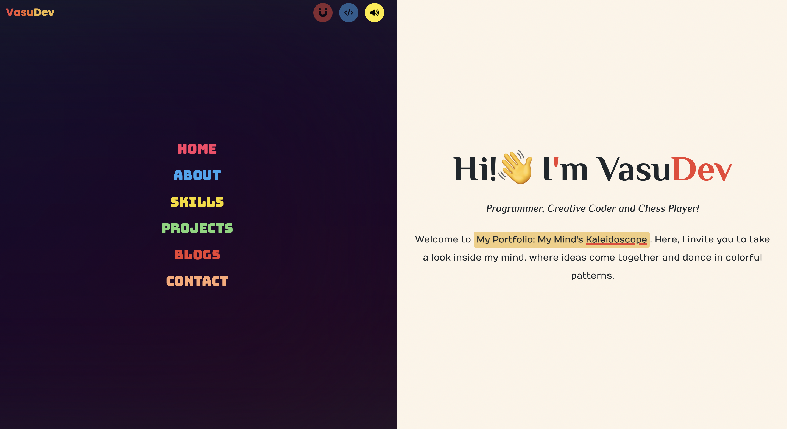
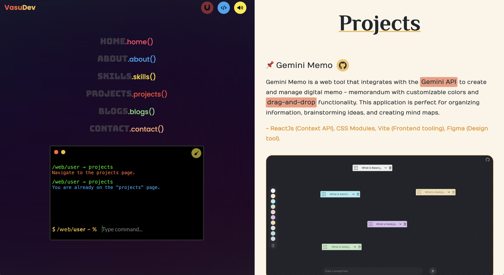
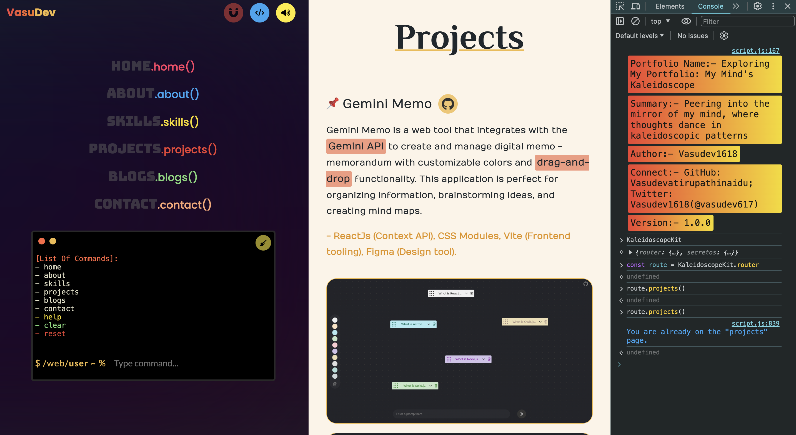

# My Portfolio: My Mind's Kaleidoscope

Personal Portfolio is a project designed using plain web technologies: **HTML, CSS, and JavaScript**, this project mimics a **Single Page Application (SPA)** with routing between pages. It features a drag-and-drop API, incorporating **drag-and-drop** in multiple innovative ways, including a terminal-like setup in developer mode. Leveraging the power of JavaScript, this portfolio showcases my projects and blogs, all presented with a sleek and engaging **UI design**.

Check out my portfolio presentation that I created with Apple Keynote (presentation software).

- HTML, CSS, JS, and Netlify (Hosting).

## Demo

## Features

- Mimics a **Single Page Application (SPA)**.
- Toggle between user and developer mode.
- Toggle sound.
- **Drag-and-drop** functionality for unique interaction with the portfolio.
- **Terminal-like** developer-friendly mode.
- Routing between pages:
  - By mouse click.
  - By drag-and-drop.
  - Via developer terminal mode.
  - By drag-and-drop on the terminal.
  - From Chrome or Firefox console log (You can find it in the video that I've uploaded in the project section).

## Usage

This website is specially designed for desktop users. For a better experience, please view it on Desktop using Google Chrome or Firefox. **For more details, please check the video that I've uploaded in the project section.**

## Contact

If you have any questions or suggestions, feel free to open an issue or reach out to me!

    
